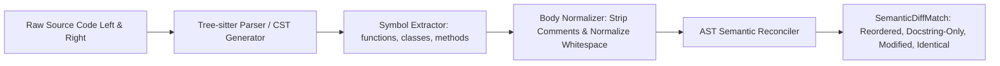
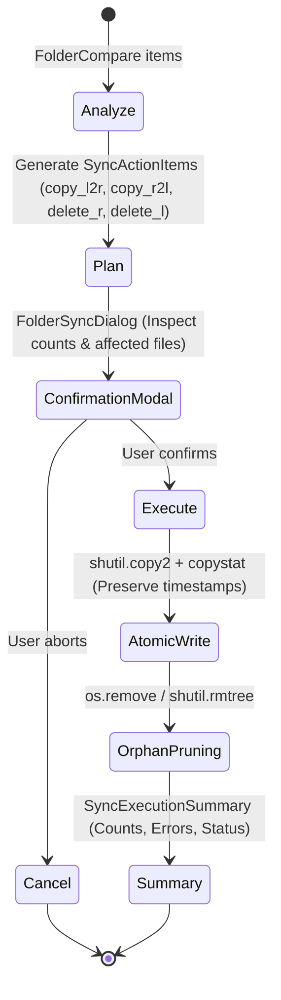
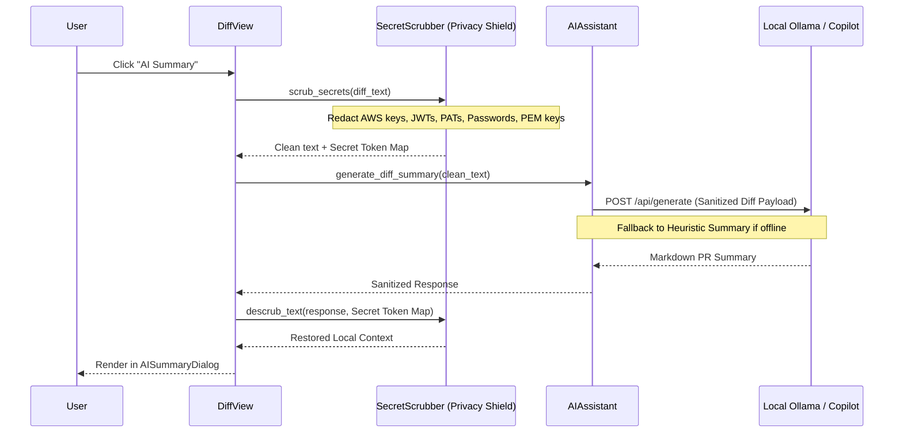

# diff_and_compare_tool — System Architecture & Design Specification

## 1. System Overview & Architectural Principles

**diff_and_compare_tool** bridges traditional line-by-line diff utilities and modern developer/data workflows. It features a decoupled, reactive architecture where domain-specific comparator engines operate beneath a modern Windows 11 Fluent presentation layer.

```mermaid
graph TD
    subgraph UI_Layer [Presentation & Shell Layer]
        MW[MainWindow - Windows 11 Fluent Shell]
        Tabs[Multi-Session Tab Manager & Workspaces]
        Diff2W[DiffView - 2-Way Code Diff + Minimap + Virtual Viewport]
        Merge3W[MergeView - 3-Way Merge Studio + Real-Time Preview]
        DirComp[DirCompareView - Folder & VFS Sync + GitIgnore]
        FolderSyncDlg[FolderSyncDialog - Sync Hub Modal]
        ImgDiff[ImageDiffView - Visual Media Studio - Images, PDF, SVG, EXIF]
        TblDiff[TabularDiffView - Keyed Grid Studio - Parquet, SQLite, Float Tol]
        TreeDiff[StructuredDiffView - Tree Studio - JSONPath, XPath, Semantic Sort]
        HexDiff[HexDiffView - MMF Binary Inspector]
        AISummaryDlg[AISummaryDialog - PR Summarizer & Conflict Resolver]
    end

    subgraph Core_Engines [Domain-Specific Comparison Engines]
        DiffEngine[DiffEngine - Myers Line + DMP Intraline + Moved Blocks + BLAKE3]
        ASTEngine[ASTSemanticDiffer - Tree-sitter CST Parser & Structural Diff]
        FolderSyncEngine[FolderSyncEngine - Mirror / Bi-directional / Update Execution]
        FolderCompEngine[FolderCompareEngine - QThread Background Scanner & .gitignore]
        ImgEngine[ImageDiffEngine - PyMuPDF PDF, SVG DOM, EXIF, Curtain, Heatmap]
        TblEngine[TabularDiffEngine - PyArrow Parquet, SQLite, Keyed Alignment, Float Tol]
        StructEngine[StructuredDiffEngine - JSONPath, XPath, Semantic Array Normalizer]
        HexEngine[HexDiffEngine - Memory-Mapped Binary Streamer]
        VFS[ArchiveVFS - Transparent ZIP/TAR Filesystem]
        AI[AIAssistant - PR Summaries & Conflict Resolver]
        Scrubber[SecretScrubber - PII & Credential Sanitizer / Privacy Shield]
        Reporter[HeadlessReporter - Standalone HTML & JSON Report Generator]
    end

    subgraph Platform_Layer [Windows 11 & Storage Integration]
        MMF[Memory-Mapped File I/O - mmap]
        WinEffects[WindowsEffects - DWM Mica Alt / Acrylic / Dark Titlebar]
        SparsePkg[MSIX Sparse Package - IExplorerCommand]
        Win32Reg[Windows Registry Context Menu]
        RemoteMgr[RemoteManager - SFTP & S3 Adapters]
        SessionMgr[SessionManager - Workspace & Active Session JSON Persistence]
    end

    MW --> Tabs
    MW --> WinEffects
    Tabs --> Diff2W & Merge3W & DirComp & ImgDiff & TblDiff & TreeDiff & HexDiff
    Diff2W --> DiffEngine & ASTEngine & Scrubber & AI
    Merge3W --> DiffEngine & Scrubber & AI
    DirComp --> FolderCompEngine & FolderSyncEngine & VFS & RemoteMgr & DiffEngine
    DirComp --> FolderSyncDlg
    FolderSyncDlg --> FolderSyncEngine
    Diff2W --> AISummaryDlg
    ImgDiff --> ImgEngine
    TblDiff --> TblEngine
    TreeDiff --> StructEngine
    HexDiff --> HexEngine & MMF
    MW --> SessionMgr & SparsePkg & Win32Reg
    Reporter --> FolderCompEngine & DiffEngine
```



---

## 2. Core Diff & Algorithmic Capabilities

### 2.1 Multi-Tier Differencing & Moved Block Detection
The text diffing pipeline combines:
1. **Tier 1 (Myers Line-Level Partitioning)**:
   - Partitions sequences into `equal`, `replace`, `delete`, and `insert` intervals.
2. **Tier 2 (Intraline Character & Word Precision)**:
   - For `replace` chunks, lines are tokenized and evaluated using `diff_match_patch`, calculating exact character spans (`CharDiffSpan`) for targeted in-line highlighting.
3. **Tier 3 (Moved Block Detection)**:
   - Identifies text/code blocks deleted from one location and inserted in another.
   - Computes token similarity ($\ge 85\%$ or hash match); matched pairs receive tag `moved`, rendering them in purple (`#8250df`) with cross-referenced destination line markers.

### 2.2 Horizontal Spacer Row Alignment & Manual Alignment Anchoring (`AlignedDiffBuilder`)
Ensures row $N$ in Left horizontally aligns with row $N$ in Right across all modification scenarios:
- **Spacer Insertion**: For `delete` opcodes, the right pane receives virtual spacer rows (`·`). For `insert` opcodes, the left pane receives virtual spacer rows (`·`).
- **Unnumbered Visual Gutter**: Real lines display their 1-indexed document line numbers; spacer rows remain unnumbered with subtle dot markers.
- **Clean File Saving**: The save engine automatically strips visual spacer lines via `get_clean_text()`, guaranteeing non-destructive disk writes.
- **Resilient Needleman-Wunsch Sub-Block Realignment (`DiffEngine.align_replace_block`)**:
  - Naive line-by-line pairing inside `replace` chunks breaks down when an inserted section shifts subsequent sections by an offset, causing completely unrelated blocks to align across from each other.
  - The engine uses Needleman-Wunsch dynamic programming with fuzzy line similarity (`difflib.SequenceMatcher.ratio()`) and section number normalization (`strip_section_number`, stripping `^[#\s]*\d+(\.\d+)*\s*`).
  - Lines with similarity $\ge 0.40$ or matching normalized headings are aligned horizontally, with inserted or omitted subsections isolated by vertical spacers on the opposing side.
- **Manual Alignment Anchoring (`manual_alignments=[(left_line, right_line), ...]` )**:
  - Users can manually anchor arbitrary matching lines by pressing `F7` or right-clicking **Align With...** and clicking the target line on the opposite editor.
  - The engine partitions documents into segments bounded by anchors: $[0 \dots \text{anchor}_1]$, $[\text{anchor}_1 \dots \text{anchor}_2]$, $\dots$, $[\text{anchor}_k \dots \text{end}]$.
  - Each segment is diffed and aligned independently. Top-level spacers are padded above each anchor to guarantee that Left line $L_k$ and Right line $R_k$ sit on the exact same display row.
  - Active manual alignments are indicated in the status command bar with a dismissible pill (`📌 X Manual Alignments [✕]`) and can be cleared via `Ctrl+F7`.

### 2.3 Hardware-Accelerated Multi-Algorithm Hashing Engine (`DiffEngine.hash_file`)
- **Native SIMD BLAKE3 Acceleration**: Utilizes Rust/C-compiled `blake3` bindings with multi-threaded tree hashing and AVX-512 / AVX2 / NEON SIMD vector extensions.
- **Streaming Memory Efficiency**: Large files are hashed using chunked 64 KB memory-mapped streams (`mmap`), bounding RAM consumption to $O(1)$ regardless of whether file size is 50 MB or 10 GB.
- **Algorithm Hierarchy**:
  - `blake3`: Default cryptographic-strength 256-bit hash at speeds up to 10-15x faster than SHA-256.
  - `sha256`: Cryptographic standard for enterprise audits and Git object parity.
  - `crc32`: Fast non-cryptographic checksum for rapid pre-pass directory comparisons.
  - `md5`: Compatibility mode for legacy workflows.

### 2.4 Tree-sitter Concrete Syntax Tree (CST) Semantic Differencing (`ASTSemanticDiffer`)
Traditional line diff engines produce extensive false-positive churn when code blocks are reordered, variable declarations are moved, or docstrings are reformatted. `ASTSemanticDiffer` introduces structural syntax-aware comparison:



- **Concrete Syntax Tree (CST) Parsing**: Employs compiled Tree-sitter grammars (`tree_sitter_python`, `tree_sitter_javascript`) to generate lossless concrete syntax trees preserving byte offsets and line indices.
- **Symbol Extraction**: Top-level definitions (`function_definition`, `class_definition`, `method_definition`) are mapped into structured `SemanticSymbol` instances containing identifier name, parameter signature, raw source span, and normalized body.
- **Body Normalization**: Strips language-specific comments (`#`, `//`, `/* ... */`) and tokenizes whitespace into canonical representations to differentiate logic mutations from styling adjustments.
- **False-Positive Elimination**: When two functions share an identical normalized body but reside at different line offsets, they are categorized as `reordered` with human-readable explanations (*"'calculate_tax' was reordered (position 2 -> 5) with identical logic"*), preventing noisy red/green diff cascades.
- **Three-Tier Fallback Hierarchy**:
  1. Tree-sitter compiled parser (fastest, full CST AST).
  2. Python standard library `ast.parse` (native AST parser for Python source).
  3. Regex-based heuristic parser (language-agnostic symbol boundary extractor).

### 2.5 View Virtualization & Decoupled Canonical Aligned Model (`ModernTextEditor`)
Standard Qt text widgets (`QPlainTextEdit`, `QTextDocument`) suffer from $O(N)$ document layout inflation and UI thread blocking on files exceeding 100,000 lines. The `ModernTextEditor` implements windowed sliding-window virtualization:

- **Decoupled Architecture (Canonical Model vs. View Layer)**:
  - **Canonical Aligned Model**: Retains the full comparison sequence as an in-memory array of `AlignedRow` dataclasses. Storing lightweight string pointers in Python memory requires merely $\approx 20\text{--}40\text{ MB}$ RAM even for 500,000 lines.
  - **View Layer Windowing**: `QTextDocument` never materializes the complete file. When scrolling, the view slices `AlignedRow[window_start : window_start + WINDOW_SIZE]` (`WINDOW_SIZE = 300`) and pushes solely that 300-line slice into the editor buffer.
  - **Independent Gutter Numbering**: Line numbers are painted in `LineNumberGutter.paintEvent` directly from `row.original_line_left` and `row.original_line_right` rather than Qt's internal document block count, ensuring spacer rows (`·`) remain unnumbered and document line numbers remain mathematically continuous.
- **Sliding-Window Model**: Activated automatically when document length exceeds 3,000 lines.
- **Memory Bounding**: Keeps the active `QTextDocument` restricted to $O(\text{window})$ ($\approx 50\text{ KB}$ memory allocation) instead of materializing multi-megabyte layouts in RAM.
- **Coordinate Transformation**:
  $$\text{window\_start} = \max\left(0, \lfloor \text{scroll\_pos} \rfloor - \text{buffer\_margin}\right)$$
  $$\text{window\_end} = \min\left(N, \text{window\_start} + \text{WINDOW\_SIZE}\right)$$
- **Transparent Virtual Height**: Injects top and bottom spacer rows dynamically into the line-number gutter, preserving native scrollbar physics and jump-to-line accuracy while maintaining 60 FPS scrolling.

### 2.6 Diff Minimap & Overview Ruler Coordinate Transformation (`DiffOverviewRuler`)
Located along the right edge of each code viewport is a 16px navigation gutter providing a bird's-eye representation of all document mutations:
- **Mathematical Coordinate Mapping**: Transforms arbitrary line numbers into canvas coordinates:
  $$y = \text{round}\left( \frac{\text{diff\_line}}{\text{total\_lines}} \times \text{ruler\_height} \right)$$
- **Semantic Color Palette**:
  - `Addition`: Emerald Green (`#22c55e`)
  - `Deletion`: Rose Red (`#ef4444`)
  - `Modification`: Royal Blue (`#3b82f6`)
  - `Conflict`: Vibrant Orange (`#f97316`)
  - `Moved Block`: Royal Purple (`#a855f7`)
- **Viewport Slider Indicator**: Renders a translucent indicator tracking the exact visible screen viewport. Clicking anywhere on the ruler recalculates the line target and instantly jumps both synchronized editors.

### 2.7 Atomic Diff Buffer Swapping (`swap_sides` / `Ctrl+U`)
- **In-Memory Transposition**: Simultaneously swaps left and right editor buffers, file paths, character encodings, and undo/redo stacks.
- **Opcode Inversion**: Inverts Myers diff opcodes atomically (`insert` $\longleftrightarrow$ `delete`) without re-reading the filesystem, recalculating diffs, or moving cursor positions.

### 2.8 3-Way Merge Studio & Real-Time Output Preview Pane (`MergeView`)
- **Quad-Viewport Architecture**:
  - Three top-tier synchronized viewports: **Mine (Local)** | **Base (Ancestor)** | **Theirs (Remote)**.
  - Collapsible bottom-tier 4th viewport: **Merge Output Live Preview**.
- **Reactive Resolution Stream**: Every conflict resolution action (`Accept Mine`, `Accept Theirs`, `Accept Base`, `Take Both`) updates the internal resolution buffer and reactively streams the merged output into the preview pane with full syntax highlighting.

---

## 3. Multi-Format & Structured Data Architecture

```mermaid
classDiagram
    class DiffEngine {
        +compute_diff(left_lines, right_lines) DiffResult
        +hash_file(filepath, algo) str
        +detect_moved_blocks(chunks, l_lines, r_lines) List~DiffChunk~
    }

    class ASTSemanticDiffer {
        +compare_semantics(left_code, right_code, language) List~SemanticDiffMatch~
        +extract_symbols(code, language) List~SemanticSymbol~
        -_normalize_code_text(text) str
    }

    class FolderSyncEngine {
        +plan_sync(items, left_dir, right_dir, mode) List~SyncActionItem~
        +execute_sync(plan, on_progress) SyncExecutionSummary
        +flatten_items(items) List~FolderCompareItem~
    }

    class FolderCompareEngine {
        +compare_directories(dir_l, dir_r, mode, respect_gitignore) List~FolderCompareItem~
        +compile_gitignore_patterns(dir_path) List~Pattern~
        +find_subfolder_match(dir_l, dir_r) Optional~str~
    }

    class ImageDiffEngine {
        +compare_images(path1, path2, tolerance) ImageDiffResult
        +render_swipe_curtain(img1, img2, ratio) Image
        +render_onion_skin(img1, img2, alpha) Image
        +rasterize_pdf_page(pdf_path, page_num, dpi) Image
        +extract_pdf_page_text(pdf_path, page_num) str
        +extract_exif_metadata(image_path) Dict~str, str~
    }

    class TabularDiffEngine {
        +compare_tables(left, right, key_column, float_tol) TabularDiffResult
        +load_parquet(path) DataFrame
        +load_sqlite_table(path, table_name) DataFrame
    }

    class StructuredDiffEngine {
        +compare(left_text, right_text, format, ignore_key_order, sort_arrays) StructuredDiffResult
        +filter_by_jsonpath(data, query) Any
        +filter_by_xpath(xml_tree, query) List~Element~
    }

    class SecretScrubber {
        +scrub_secrets(text) Tuple~str, Dict~str, str~~
        +descrub_text(text, scrub_map) str
    }

    class HeadlessReporter {
        +run_folder_comparison(dir_a, dir_b, report_html_path, mode) Tuple~int, str~
        +run_file_comparison(file_a, file_b, report_html_path) Tuple~int, str~
        -_generate_folder_html_report(...) void
    }
```



### 3.1 Structured Data Engine (JSON, YAML, XML)
- **JSONPath & XPath Query Engine**: Evaluates user-specified JSONPath expressions (`jsonpath-ng`) and XPath queries (`xml.etree`) to isolate relevant sub-trees prior to comparison, filtering out extraneous root-level metadata.
- **Semantic Unordered Array Alignment**: Automatically hashes or key-aligns array/list elements when array ordering is non-semantic, preventing false differences when arrays contain identical elements in different order.
- **Key Normalization**: Recursively sorts dictionary/object keys (`ignore_key_order=True`) to maintain structural identity across differing serialization routines.

### 3.2 Tabular & Spreadsheet Engine (CSV, TSV, Excel, Parquet, SQLite)
- **Apache Parquet Ingestion & Streaming Projection**: Leverages `pyarrow.parquet` and `pyarrow.dataset.Scanner` for zero-copy streaming of columnar `.parquet` datasets. On multi-gigabyte files, the engine fetches solely user-projected column batches, preventing memory exhaustion.
- **SQLite Database Ingestion & Chunked Cursors**: Reads `.sqlite`, `.sqlite3`, and `.db` tables dynamically via `sqlite3`. Rather than issuing unrestrained `SELECT *`, it queries schema headers first (`PRAGMA table_info`), binds the designated primary key, and streams ordered records using cursor `fetchmany(5000)` batches to maintain a strictly bounded memory footprint.
- **$\epsilon$-Based Numerical Tolerance**: Floating-point comparisons evaluate delta conditions:
  $$\Delta = |v_{\text{left}} - v_{\text{right}}| \le \epsilon$$
  When $\Delta \le \text{tolerance}$, cells are classified as identical, eliminating false-positive floating-point rounding mismatches (e.g. `3.141592` vs `3.141593`).
- **Keyed Row Alignment**: Primary Key selection maps rows into hash tables, enabling accurate identification of added, deleted, and modified rows regardless of row order.

### 3.3 Visual Media & Document Diff Studio (Images, Multi-Page PDF, SVG, EXIF)
- **Multi-Page PDF Rasterization (`fitz` / PyMuPDF)**: Rasterizes vector PDF pages at 150-300 DPI into high-fidelity image buffers. Users navigate pages sequentially (`◀ Page X/Y ▶`) with synchronized page stepping.
- **Extracted Document Text Diff**: PyMuPDF extracts embedded character streams and passes them into the 2-way text engine for side-by-side textual diffing of PDF documents.
- **Scalable Vector Graphics (SVG)**: Renders vector XML DOM structures directly into anti-aliased bitmap viewports.
- **Photographic EXIF & Metadata Extraction**: Parses raw image metadata via `PIL.ExifTags` (camera make, lens, exposure time, aperture, ISO, GPS coordinates, ICC profiles) and produces a side-by-side tabular delta view.
- **Pixel-Level Heatmap Euclidean Delta**:
  $$\Delta = \max\left(|R_1 - R_2|, |G_1 - G_2|, |B_1 - B_2|, |A_1 - A_2|\right)$$
  Pixels exceeding tolerance are rendered in high-contrast neon magenta (`#ff007f`).
- **Curtain, Onion-Skin & Flicker**:
  - Curtain: Interactive mouse-drag split curtain divider.
  - Onion-Skin: Linear alpha interpolation:
    $$P_{\text{composite}} = \alpha \cdot P_{\text{left}} + (1 - \alpha) \cdot P_{\text{right}}$$
  - Flicker: `QTimer`-driven 400ms state toggle to make micro-mutations visually apparent.

### 3.4 Memory-Mapped Hex & Binary Engine
- **Zero Memory Exhaustion**: Uses `mmap.mmap()` to stream multi-gigabyte binaries without loading files entirely into memory.
- **Paged Virtualization**: Dynamically reads 16-byte aligned rows on demand (`read_row_range`) for ultra-responsive scrolling across multi-gigabyte files.

### 3.5 Virtual Archive Filesystem (VFS)
- Transparently navigates `.zip`, `.jar`, `.tar`, `.tgz`, `.tar.gz`, and `.tar.bz2` archives as expandable virtual directories, reading individual member streams directly into memory without disk extraction.

### 3.6 High-Performance Folder Comparison Engine
- **Asynchronous Worker Threading & Event-Loop Batch Throttling (`FolderCompareWorker`)**:
  - Scanning (`os.walk`), metadata extraction, and file hashing execute inside a dedicated `QThread`.
  - Rather than emitting granular progress signals for every single file (which saturates Qt's cross-thread event queue during 50,000+ item scans), the worker employs an adaptive batch throttle (emitting batches of 250 items or upon reaching a 50ms time window: `len(batch) >= 250 or (now - last_emit) > 0.05`).
  - The Qt main event loop remains unblocked, maintaining silky-smooth 60 FPS UI responsiveness throughout multi-gigabyte directory scans.
- **Smart `.gitignore` & Exclusion Rules**:
  - Detects `.gitignore` and `.hgignore` files at repository roots.
  - Compiles gitignore glob patterns into compiled regexes, immediately skipping bloat directories (`node_modules/`, `__pycache__/`, `.git/`, `.venv/`, `target/`) during directory traversal.
- **Strict Orphan Status Preservation**:
  - Folders are marked as `DIFF` only if they exist on **both** sides and contain differing children. Single-sided directories strictly preserve `LEFT_ONLY` or `RIGHT_ONLY` designations.
- **$O(1)$ Synchronous Tree Navigation**:
  - Nodes store direct partner references in `Qt.UserRole + 1`, enabling instantaneous $O(1)$ expand/collapse synchronization across Left, Gutter, and Right trees.
- **Folders-First Tuple Ordering**:
  - Recursively ordered via key $(\neg \text{is\_dir}, \text{name.lower()})$, guaranteeing directory branches group before file leaves.
- **In-Memory View Filtering**:
  - Filtering by `* All`, `≠ Diffs`, or `= Same` operates directly on existing `QTreeWidgetItem` instances via `.setHidden()`, completing in $<15\text{ms}$.
- **Centered Gutter Architecture (`GutterItemDelegate`)**:
  - Standard Qt `QTreeWidget` viewports shift `option.rect` by `tree.indentation() * depth`, causing nested child items to migrate rightward and clip against column boundaries.
  - `GutterItemDelegate` overrides `paint()`, recalculating the render bounding box as `QRect(0, option.rect.y(), option.widget.viewport().width(), option.rect.height())`. Status glyphs (`≠`, `←`, `→`, `=`) are centered horizontally and vertically across the column's full 64px width regardless of tree hierarchy depth.
  - Native scrollbars on the gutter tree are disabled (`ScrollBarAlwaysOff`), while vertical translation is driven in lockstep via scrollbar signals from the left and right trees.
- **Subfolder Heuristics (`find_subfolder_match`)**:
  - Analyzes top-level directories to detect modular subcomponent extraction and provides a 1-click re-rooting recommendation banner.

### 3.7 Interactive Folder Synchronization Engine (`FolderSyncEngine`)
Provides transactional, safe filesystem synchronization across directory trees:



- **Four Synchronization Modes**:
  1. `MODE_MIRROR_L2R`: Exact mirror of Left to Right (overwrites newer files on Right, copies missing files to Right, deletes orphans on Right).
  2. `MODE_BIDIRECTIONAL`: Propagates newest modification timestamps both ways; preserves files unique to either side.
  3. `MODE_UPDATE_LEFT`: Copies missing or newer files from Right to Left; leaves orphans intact.
  4. `MODE_UPDATE_RIGHT`: Copies missing or newer files from Left to Right; leaves orphans intact.
- **Two-Phase Transactional Model**:
  - **Phase 1 (Plan)**: `plan_sync()` evaluates differences and compiles an immutable action plan (`SyncActionItem`).
  - **Phase 2 (Execute)**: `execute_sync()` processes items sequentially with atomic file writes, creating target parent directories as needed and preserving modification timestamps via `shutil.copystat`.

---

## 4. Next-Gen AI & Privacy Shield Engine



### 4.1 Local LLM Orchestration (`AIAssistant`)
- **Local-First Ollama Protocol**: Communicates via standard REST APIs (`POST /api/generate`) with local inference daemons (Ollama, LM Studio). Recommended models: `qwen2.5-coder:7b`, `deepseek-coder`, `codellama`.
- **Zero Cloud Leakage**: All diff payload analysis can run 100% locally on localhost without external API requests.
- **Intelligent Heuristic Fallback**: If local LLM daemons are unreachable, the engine gracefully falls back to a rule-based semantic analyzer that extracts churn metrics, risk tiers, and file summaries.

### 4.2 Automated Secret & PII Scrubber Engine (`SecretScrubber`)
Protects sensitive infrastructure credentials, authentication tokens, and personal data from being ingested by AI models:
- **Multi-Pattern Regex Pipeline**:
  - AWS Access Key IDs (`AKIA[0-9A-Z]{16}`) and Secret Access Keys.
  - GitHub Personal Access Tokens (`ghp_*`, `github_pat_*`).
  - RSA, DSA, EC, and OpenSSH Private Keys (`-----BEGIN ... PRIVATE KEY-----`).
  - JSON Web Tokens (`eyJ...`).
  - Generic Bearer tokens, API keys, and authorization headers.
  - Database connection strings and hardcoded passwords (`password = "..."`).
- **Deterministic Token Redaction**: Replaces sensitive data with unique placeholders (e.g. `[REDACTED_AWS_ACCESS_KEY]`, `[REDACTED_JWT_TOKEN]`).
- **Reversible De-Scrubbing**: Maintains an isolated, in-memory token map (`Dict[str, str]`) allowing local presentation restoration while ensuring LLM prompts never receive raw credentials.

---

## 5. Native Windows 11 Architecture & Performance

### 5.1 Windows 11 Shell Context Menu & Branded Verbs
- **Top-Level Branded Registry Integration**: Context menu verbs are registered under `HKEY_CURRENT_USER\Software\Classes`:
  - `*\\shell\\DiffAndCompareToolCompare` ("Compare with diff_and_compare_tool")
  - `*\\shell\\DiffAndCompareToolSelectLeft` ("diff_and_compare_tool: Select Left")
  - `*\\shell\\DiffAndCompareToolSelectRight` ("diff_and_compare_tool: Select Right")
  - Mirrored across `Directory\\shell` and `Directory\\Background\\shell`.
- **Direct Icon Path Binding**: Registry keys bind `"Icon"="<repo_path>\\assets\\app_icon.ico"` directly, allowing Windows Explorer to render the native multi-resolution icon next to each menu item with zero process startup overhead.
- **Legacy Cleanup**: The installation engine automatically purges obsolete keys (`DiffAndCompareSelectLeft`, etc.) to prevent duplicate or orphaned menu entries.
- **MSIX Sparse Package (`IExplorerCommand`)**: Registered via an MSIX Sparse Package (`windows/AppxManifest.xml`) utilizing the `windows.fileExplorerContextMenu` extension, enabling top-level Windows 11 context menu placement without falling back to "Show more options".

### 5.2 Application Icon Architecture & Desktop Integration
- **Multi-Resolution Windows Icon Pipeline (`app_icon.ico`)**:
  - Master vector artwork defined in `assets/app_icon.svg` with dual Fluent comparison cards, neon diff lines, and a central glowing bidirectional sync badge (`⇄`).
  - The compiled `assets/app_icon.ico` embeds 7 discrete raster mipmaps: `256×256`, `128×128`, `64×64`, `48×48`, `32×32`, `24×24`, and `16×16`, rendered using Lanczos supersampling for crisp readability across Windows taskbars, Alt+Tab switchers, and high-DPI displays.
- **Windows Explicit AppUserModelID**:
  - `ctypes.windll.shell32.SetCurrentProcessExplicitAppUserModelID("diff_and_compare_tool.Studio.2.0")` is invoked during app launch.
  - Groups taskbar icons independently from the generic `python.exe` interpreter and ensures the custom icon is displayed in the Windows taskbar and notification area.

### 5.3 Hardware & Threading Optimization
- **Per-Monitor High-DPI Scaling**: Configured via `QT_AUTO_SCREEN_SCALE_FACTOR=1` with native Segoe UI typography.
- **Multi-Algorithm NVMe Hashing**: Streaming multi-threaded `mmap` hashing supporting `BLAKE3`, `SHA-256`, `CRC32`, and `MD5`.
- **ARM64 Native Execution**: Fully compatible with native Windows on ARM64 devices (Surface Pro, Qualcomm Snapdragon X Elite).

### 5.3 Windows 11 DWM Modern Backdrop Effects (`WindowsEffects`)
Integrates directly with the Windows 11 Desktop Window Manager (DWM) using `ctypes` Win32 API calls into `dwmapi.dll`:

```python
# dwmapi.DwmSetWindowAttribute interop
DWMWA_USE_IMMERSIVE_DARK_MODE = 20
DWMWA_WINDOW_CORNER_PREFERENCE = 33
DWMWA_SYSTEMBACKDROP_TYPE = 38

# System Backdrop Types
BACKDROP_AUTO = 0
BACKDROP_NONE = 1
BACKDROP_MICA = 2
BACKDROP_ACRYLIC = 3
BACKDROP_MICA_ALT = 4       # Tabbed Mica Backdrop
```

- **Mica Alt Material**: Applies `BACKDROP_MICA_ALT` (Type 4) to the root window handle (`HWND`), rendering a tinted translucent backdrop that harmonizes with Windows 11 desktop themes and tabbed interfaces.
- **Immersive Dark Mode**: Toggles `DWMWA_USE_IMMERSIVE_DARK_MODE` synchronously with application theme changes, rendering native dark-themed titlebars and caption buttons.
- **Rounded Window Corners**: Enforces Windows 11 standard rounded corner preferences (`CORNER_ROUND`).
- **Safe Graceful Degradation**: On Windows 10 (Build $<22000$) or non-Windows platforms, DWM calls fail safely with zero exceptions, falling back to standard Fluent QSS styling.

### 5.4 Hardware & Threading Optimization
- **Per-Monitor High-DPI Scaling**: Configured via `QT_AUTO_SCREEN_SCALE_FACTOR=1` with native Segoe UI typography.
- **Multi-Algorithm NVMe Hashing**: Streaming multi-threaded `mmap` hashing supporting `BLAKE3`, `SHA-256`, `CRC32`, and `MD5`.
- **ARM64 Native Execution**: Fully compatible with native Windows on ARM64 devices (Surface Pro, Qualcomm Snapdragon X Elite).

### 5.5 Dynamic Tab Lifecycle, Navigation & Home Launcher Architecture
The tabbed shell implements a decoupled, dynamic lifecycle managed by `MainWindow`:
- **Decoupled Studio Instantiation (`_get_or_create_tab`)**: Rather than binding fixed static child instances to the UI shell at startup, `MainWindow` instantiates studios lazily or reuses clean, unconfigured tabs. If an open tab of the requested type has no active comparison files, it is selected; otherwise, a new instance is created and appended to `QTabWidget`.
- **Ghost Tab Elimination**: In previous designs, closing a tab removed it from `QTabWidget` without resetting references, causing subsequent `setCurrentWidget` calls to fail silently. The dynamic pattern guarantees every tab operation resolves to an active, mounted widget attached to `self.tabs`.
- **Clean Startup Contract**: Cold launches mount only the signature `HomeView` dashboard at tab index 0. Blank studio tabs are never pre-allocated, preserving system resources and presenting a clean, uncluttered user experience matching Beyond Compare.
- **Permanent Home Dashboard Protection**: Tab 0 (`HomeView`) is pinned and permanent. Its tab close button is explicitly stripped via `QTabBar.setTabButton(idx, RightSide, None)` and `_on_tab_close` enforces a strict guard against closure. Clicking the Home toolbar button or `Session → Home Screen` safely activates or re-inserts `HomeView`.
- **WAL Journal Lifecycle Hooks**: Closing a comparison tab cleanly invokes `wal.clean_exit()` on the child view, closing append-only journal handles before removing the tab page from Qt.
- **Dynamic Property Gateways**: Backward-compatible property gateways (`self.diff_tab`, `self.image_tab`, `self.dir_compare_tab`, etc.) ensure any legacy or external programmatic invocation resolves to an attached, visible studio instance.

### 5.6 Rich Session Restoration & Persistence Schema
The `SessionManager` persists and restores complete workspace sessions to `%APPDATA%/diff_and_compare/active_session.json`:
- **Active Tab Index & Viewer Type**: Restores whether tabs were 2-Way Text, 3-Way Merge, Folder Compare, Image Diff, Tabular Diff, Structured Tree, or Hex.
- **Left and Right File Paths**: File paths and directory roots are preserved across app restarts.
- **Encoding & Viewer Preferences**: Character encoding (`utf-8`, `latin-1`), spacer alignment toggles, and line wrapping states.
- **Window Geometry**: Window coordinates, maximized state, and splitter handle ratios.

### 5.7 Standalone Executable Footprint Optimization (`build.py`)
Packaging multi-format dependencies (PySide6, PyMuPDF, PyArrow, Tree-sitter, BLAKE3) can inflate binary distributions. The build system implements targeted pruning:
- **One-Folder Architecture (`--onedir`)**: Avoids the $500\text{ MB}$ extraction penalty of single-file `--onefile` packaging to `%TEMP%` on every startup, ensuring instantaneous cold launches.
- **Unused Qt Module Exclusion**: Explicitly strips unreferenced heavy modules: `PySide6.QtQuick`, `PySide6.QtQml`, `PySide6.QtSensors`, `PySide6.QtTest`, `PySide6.QtNetworkAuth`, `matplotlib`, and `scipy`.
- **Embedded PE Resources**: Injects `assets/app_icon.ico` directly into the PE header via `--icon assets/app_icon.ico` and bundles the `assets/` directory cleanly.

---

## 6. Headless CI/CD & Automation Engine (`HeadlessReporter`)

The `HeadlessReporter` provides non-GUI batch diffing and automated report generation for continuous integration and DevOps pipelines:

```bash
# Headless folder comparison with exit code and HTML report
python -m app.main --headless --folder-diff path/to/dir_a path/to/dir_b --report-html build/reports/diff_report.html --exit-code

# Headless file comparison
python -m app.main --headless --diff path/to/file_a.py path/to/file_b.py --report-html diff.html --exit-code
```

### 6.1 Exit Code Specification
The `--exit-code` flag returns standard POSIX exit codes suitable for automated pipeline gating:
- `0`: **Identical** — No content, binary, or structural differences detected.
- `1`: **Mismatch** — Differences detected (files modified, left-only, or right-only).
- `2`: **Error** — Fatal invocation error (invalid path, permission denied, missing file).

### 6.2 Standalone HTML Report Architecture
- **Self-Contained Single-File Output**: Generates an all-in-one HTML report with zero external CDN scripts, stylesheets, or web requests, making it safe for air-gapped environments.
- **Responsive Fluent Dark/Light Theme**: Built-in CSS with modern responsive tables, badges, and clean typography.
- **Side-by-Side Code Diff Tables**: Color-coded line additions (green), deletions (red), and modifications (blue) with aligned line numbering.
- **Directory Tree Summary Badges**: Collapsible folder lists with real-time statistics counters (`Total Files`, `Diffs`, `Left Only`, `Right Only`, `Identical`).

---

## 7. Windows 11 Fluent UI Architecture & Styling Standards

### 7.1 Scoped QSS Rules & Cascade Isolation
Qt Style Sheets (QSS) cascade generic widget-type selectors (`QWidget { ... }`, `QFrame { ... }`) down to all child descendants. To guarantee visual integrity and prevent accidental border bleeding:
- **Strict ID Scoping**: All toolbars, ribbons, and header strips must use explicit object names (`#EditorHeader`, `#DiffCmdBar`, `#DirRibbon`, `#MergeRibbon`, `#ImageFileBar`, `#ImageCmdBar`).
- **Child Widget Isolation**: Labels (`QLabel`), checkboxes (`QCheckBox`), and comboboxes (`QComboBox`) are explicitly guarded (`border: none; background: transparent;`) so they never inherit container divider lines or gradient fills.

### 7.2 Unified Tab Bar & Corner Action Geometry
- **Standardized Control Types**: Corner navigation buttons (**Home**, **New Tab**, **Workspaces**) are implemented as unified `QPushButton` components with matching 28px heights, 6px border radii, and 500-weight typography.
- **Vector Line Icons**: Icons are rendered on-demand as crisp Feather/Lucide vector SVG icons via `get_line_icon(name, color)` in theme-coordinated stroke colors (`#0969da` blue, `#475569` slate).
- **Centered Menu Indicators**: Dropdown action buttons attached via `setMenu()` utilize native, vertically-centered dropdown indicators with balanced padding, replacing unstyled, sagging corner indicators.

### 7.3 Vector Form Control & Checkbox Architecture
- **Multi-State Indicator Styling**: Checkbox indicators define explicit styles for default (`#ffffff` / `#0b1120`), hover (`#eff6ff` / `#1e293b`), and checked states.
- **Embedded Checkmark Assets**: Checked checkboxes reference high-DPI vector checkmark images (`image: url(...)`) across both Light (`#2563eb` gradient) and Dark (`#0284c7`) themes, eliminating blank blue swatch rendering.

### 7.4 Per-Pane Telemetry & Diff Metrics HUD
- **Contextual Tooltips**: File header badges display color-coded deltas (`+added` in green, `-deleted` in red, `~modified` in blue) backed by explanatory tooltips (*"Differences in this file: +added, -deleted, ~modified"*).
- **Zero-State Suppression**: When no differences exist, badge labels automatically toggle `setVisible(False)` to avoid displaying empty framed placeholders.

### 7.5 Media & Document Comparison Toolbar Architecture
- **Contextual Multi-Page Controls**: Multi-page pagination controls (`btn_prev_page`, `lbl_page`, `btn_next_page`) are grouped within a dedicated `page_container` and automatically suppressed (`setVisible(False)`) when evaluating single images or when no documents are active.
- **Zero-Padding Icon PushButtons**: Compact pagination buttons enforce `padding: 2px` with explicit `get_line_icon` vector arrows (`arrow-left`, `arrow-right`), preventing global button padding from truncating icon bounding boxes into empty frames.
- **Vector Line Toggles**: Inspection toggles (**Text Diff**, **EXIF / Metadata**) utilize vector Feather line icons (`file-text`, `sliders`) in place of platform-inconsistent Unicode emojis.

---

## 8. Enterprise Resilience, Streaming, & Semantic Contract Architecture

### 8.1 Direct CLI Stream & Stdin Diffing (`stream_diff.py`)
Allows comparing piped outputs directly from PowerShell, CMD, Bash, or CI/CD pipelines without creating manual temporary scratch files on disk:
```powershell
# Compare Git history revision against active working tree via stdin
git show HEAD~1:main.py | diff_and_compare_tool.exe --diff - main.py

# Compare command outputs
cat expected.json | diff_and_compare_tool.exe --diff - actual.json
```
- **Virtual Stream Buffer**: Detects `-` as stdin, dynamically buffering streaming input bytes via `resolve_stream_input()`, adopting opposing file extension for syntax highlighting, and registering `atexit` scratch cleanup.
- **Custom Viewport Branding**: Header strips display custom readable titles (*"Standard Input (stdin)"*) rather than temporary system paths.

### 8.2 Single-Instance IPC Tab Remoting (`ipc_manager.py`)
Provides desktop-grade tab remoting via Windows Named Pipes (`QLocalServer` / `QLocalSocket`):
- **Named Pipe Architecture**: Computes user-specific server names (`diff_and_compare_tool_IPC_<username>`).
- **Foreground Activation**: Secondary invocations (from terminal or Explorer context menu) serialize arguments and working directory, dispatching them to the running instance before exiting immediately with exit code `0`.
- **Target Focus**: Primary window receives payload, routes files into a new tab in the active window, and executes `showNormal()`, `activateWindow()`, and `raise_()` to focus the UI.
- **Bypass Flags**: Bypassed when `--new-window` or headless flags (`--headless`, `--report-html`, `--exit-code`) are passed.

### 8.3 Live Visual Git Chunk Staging (`git_staging.py`)
Integrates partial commits and repository hunk operations directly into the 2-Way Diff View:
- **Zero-Context Patch Synthesis**: Builds unified unidiff-zero patches (`--- a/...`, `+++ b/...`, `@@ -a,c +b,d @@`) for selected diff chunks.
- **Git Index Staging**: Executes `git apply --cached --unidiff-zero -` asynchronously against the repository root.
- **Hunk Discard & Revert**: Executes `git apply --reverse --unidiff-zero -` to revert working copy modifications in-place.
- **Unstaging**: Executes `git apply --cached --reverse --unidiff-zero -` to pop staged chunks from the index without touching disk.
- **Interactive UI**: Accessible via the Diff Command Bar `Git` dropdown, editor context menus, and right-click on the `DiffConnectorWidget` between panes.

### 8.4 Contract & Semantic API Schema Difference Engine (`contract_diff.py`)
Headless semantic contract difference engine supporting automated CI/CD and script validation:
1. **OpenAPI / Swagger 2.0 & 3.x (JSON/YAML)**: Endpoints, HTTP verbs, required vs optional parameters, request bodies, and response status codes.
2. **GraphQL SDL (`.graphql`, `.gql`)**: Types, inputs, interfaces, enums, unions, field nullability (`!` non-null), and field arguments.
3. **Protocol Buffers v2 & v3 (`.proto`)**: Services, RPCs, messages, field tags, types, cardinality (`repeated` vs scalar), and tag collisions.

**Breaking Change Classification Matrix**:
- 🔴 **Breaking Change**: Removed endpoint/method, newly required parameter, deleted response field, altered field type, enum value removed, protobuf field tag modified/reused without `reserved`.
- 🟡 **Warning / Deprecation**: Endpoint marked deprecated, optional parameter removed.
- 🟢 **Additive (Backward Compatible)**: New endpoint, new optional parameter, new response field, new GraphQL type, new protobuf tag.

### 8.5 Write-Ahead Log (WAL) Crash Recovery Journaling (`wal_journal.py`)
Ensures zero data loss during in-place text and code editing:
- **Append-Only Disk Journal**: Logs every keystroke and live buffer mutation into `%APPDATA%/diff_and_compare/wal/<session_id>.wal` using JSONL records.
- **Hardware Flush Guarantee**: Uses `os.fsync()` to ensure writes reach non-volatile physical storage before returning.
- **Abnormal Shutdown Detection**: Scans unclosed WAL journals on startup; if dirty buffers exist without a corresponding `CLEAN_EXIT` or `SAVED` record, prompts user with a recovery dialog.
- **Automatic Pruning**: Upon graceful exit (`MainWindow.closeEvent`), journals write `CLEAN_EXIT` and are pruned from disk automatically.
